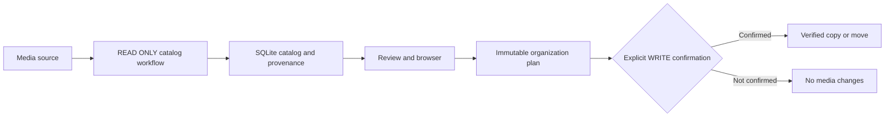
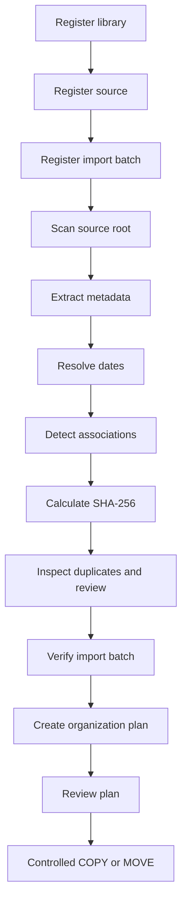
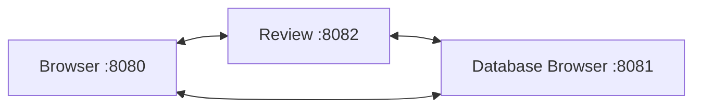

# User Guide

## What This Toolkit Does

Media Library Toolkit helps build a trustworthy local catalog before any physical organization happens. It records what each file is, where it came from, when it was likely captured, whether it is an exact duplicate, and what operation would be safe to perform later.

The catalog is SQLite. Original media remains untouched during inventory, metadata extraction, date resolution, hashing, duplicate detection, review, and planning.



## The Three Operation Modes

| Mode | Purpose | Can it change original media? |
| --- | --- | --- |
| READ ONLY | Scan, inspect, extract metadata, resolve dates, hash, find duplicates, browse, and review. | No. |
| DRY RUN | Create and inspect an immutable organization plan. | No. |
| WRITE | Apply one reviewed plan through controlled COPY or MOVE. | Only with the exact plan ID confirmation. |

Never use a production library as an experiment. Start with the `test` profile and a small synthetic folder.

## First-Time Setup

Install the project and activate its environment:

```bash
git clone https://github.com/adriamuixi/media-library-toolkit.git
cd media-library-toolkit
./scripts/bootstrap.sh --install-system-dependencies
source .venv/bin/activate
```

Create a disposable test catalog:

```bash
media --profile test init
media --profile test db status
```

Resetting a TEST catalog is available when you want to start over:

```bash
media --profile test db reset --confirm-reset
```

The command refuses production catalogs.

## Recommended Workflow for a New Source

Use this sequence every time you bring in a disk, phone export, camera card, or archive folder.



### 1. Register the library, source, and batch

```bash
media --profile test library add "Personal Media"

media --profile test source add \
  --library "Personal Media" \
  --name "iPhone Export" \
  --type iphone \
  --default-timezone Europe/Madrid

media --profile test batch add \
  --library "Personal Media" \
  --source "iPhone Export" \
  --name "IPHONE_2026_08"
```

A source describes where media came from. A batch describes one bounded import from that source. These values become immutable provenance.

### 2. Scan without modifying media

```bash
media --profile test scan \
  --library "Personal Media" \
  --source "iPhone Export" \
  --batch "IPHONE_2026_08" \
  --root "/path/to/source" \
  --media-type all
```

Scanning inventories regular files and stores only portable relative paths. It does not copy, rename, move, or write sidecar files.

### 3. Extract evidence and calculate identities

```bash
media --profile test metadata \
  --library "Personal Media" \
  --source "iPhone Export" \
  --root "/path/to/source" \
  --media-type all

media --profile test dates resolve \
  --library "Personal Media" \
  --source "iPhone Export" \
  --media-type all

media --profile test associations detect \
  --library "Personal Media" \
  --source "iPhone Export"

media --profile test hashes calculate \
  --library "Personal Media" \
  --source "iPhone Export" \
  --root "/path/to/source" \
  --media-type all
```

This stage records metadata, date evidence, related-file relationships, and exact SHA-256 identities in SQLite. It does not modify embedded EXIF, IPTC, XMP, QuickTime metadata, or media bytes.

### 4. Inspect and verify the import

```bash
media --profile test duplicates exact \
  --library "Personal Media" \
  --media-type all

media --profile test import summary \
  --library "Personal Media" \
  --batch "IPHONE_2026_08"

media --profile test import verify \
  --library "Personal Media" \
  --batch "IPHONE_2026_08"
```

Verification refuses an incomplete batch. It requires every observed file in the batch to have hash, metadata, and date-resolution records, then stores an immutable completion record. It also reports files whose SHA-256 identity already appeared in another historical batch.

## Review the Catalog Locally

After a source has been processed, launch every local interface together:

```bash
media --profile test web \
  --library "Personal Media" \
  --root "/path/to/organized-library"
```



| Interface | Use it for |
| --- | --- |
| Browser | Browse organized photos and videos, search provenance, inspect details, and view duplicates. |
| Review | Review exact duplicate groups and date conflicts without changing media. |
| Database Browser | Inspect SQLite tables, migrations, saved queries, and relationships technically. |

The services are loopback-only. Press `Ctrl+C` once in the terminal that launched `media web` to stop all three.

## Create and Review an Organization Plan

Planning proposes deterministic destinations; it does not change files.

```bash
media --profile test plan create --library "Personal Media"
media --profile test plan list --id PLAN_ID
media --profile test plan export --id PLAN_ID --output /safe/location/plan.csv
```

The plan is checksummed and immutable. Resolve reported conflicts before any WRITE operation. A plan preserves original provenance in SQLite even after a later physical location transition.

## Apply a Controlled WRITE Operation

Only apply a clean, reviewed plan. Use COPY first when evaluating a new library structure.


```bash
media --profile test operations copy \
  --plan PLAN_ID \
  --source-root "/path/to/source" \
  --destination-root "/path/to/organized-library" \
  --confirm-write PLAN_ID
```

COPY verifies SHA-256 at the destination and never overwrites an existing file. MOVE follows the same validation after a verified copy and requires its own explicit command:

```bash
media --profile test operations move \
  --plan PLAN_ID \
  --source-root "/path/to/source" \
  --destination-root "/path/to/organized-library" \
  --confirm-write PLAN_ID
```

Do not use MOVE until the copied library has been reviewed and independently backed up.

## What to Do When Something Is Uncertain

| Situation | Safe next action |
| --- | --- |
| A file changed after scan | Run `media scan` again before metadata or hashing. |
| Date is `CONFLICT`, `SUSPICIOUS`, or `NO_DATE` | Use Local Review; do not invent a capture date. |
| Duplicate group has no preferred member | Review it manually; no cleanup is automatic. |
| Import verification fails | Run the missing READ ONLY stage, then rerun `media import summary`. |
| Plan has conflicts | Review or change input conditions, then create a new plan. |
| You need a fresh test | Reset only with `media --profile test db reset --confirm-reset`. |

## Backups and Exports

Back up the catalog before important WRITE work:

```bash
media --profile test db backup --output /safe/location/catalog-backup.sqlite3
media --profile test provenance export \
  --library "Personal Media" \
  --output /safe/location/provenance.csv \
  --format csv
```

SQLite remains the source of truth. CSV and JSON exports are open, portable backup and consultation copies.
